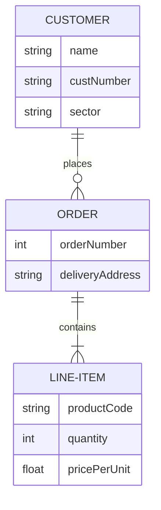

# Database
This repository contains all of my work related to database design and development classes, including assignments, designs, and projects. It's organized into separate folders for each class, with subfolders for each assignment or project. Each assignment or project includes the code, documentation, and any other relevant materials.

The repository includes a variety of assignments and projects that cover topics such as relational database design, SQL query optimization, database normalization, and data modeling. There are also projects that explore NoSQL databases, distributed databases, and cloud-based databases.

The repository includes a README file that provides an overview of the repository's contents, instructions for how to use the code and run the projects, and any other important information. Additionally, the repository includes sample data sets and test scripts that can be used to verify the functionality of the database designs and queries.

In addition to the class assignments, this repository includes personal projects or contributions to open-source database projects. These projects are organized into separate folders and include the code, documentation, and any relevant data or test scripts.

Overall, this repository serves as a comprehensive record of my database design and development work, covering a range of topics and database technologies. It demonstrates my ability to design and develop efficient and scalable databases, optimize database queries, and work with a variety of database management systems and tools.