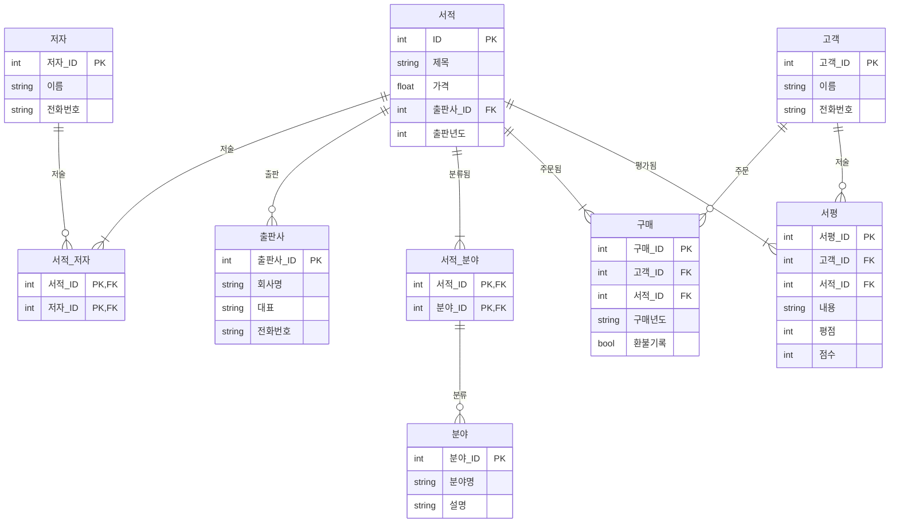
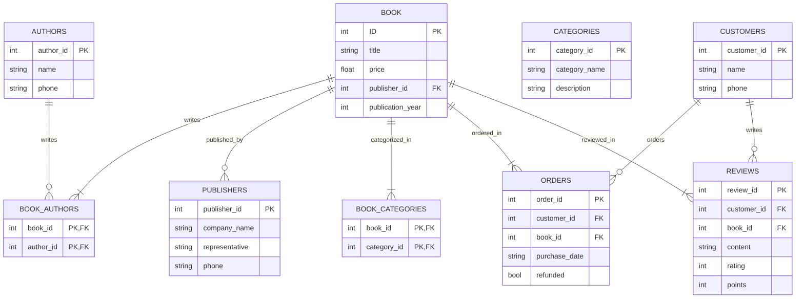

<!-- 기본 mermaid 틀 -->

```mermaid
```

```mermaid
erDiagram
    서적 ||--|{ 서적_저자 : 저술
    서적 ||--o{ 출판사 : 출판
    서적 ||--|{ 서적_분야 : 분류됨
    서적 ||--|{ 구매 : 주문됨
    서적 ||--|{ 서평 : 평가됨
    서적 {
        int ID PK
        string 제목
        float 가격
        int 출판사_ID FK
        int 출판년도
    }
    서적_저자 {
        int 서적_ID PK, FK
        int 저자_ID PK, FK
    }
    저자 ||--o{ 서적_저자 : 저술
    저자 {
        int 저자_ID PK
        string 이름
        string 전화번호
    }
    출판사 {
        int 출판사_ID PK
        string 회사명
        string 대표
        string 전화번호
    }
    서적_분야 ||--o{ 분야 : 분류
    서적_분야 {
        int 서적_ID PK, FK
        int 분야_ID PK, FK
    }
    분야 {
        int 분야_ID PK
        string 분야명
        string 설명
    }
    고객 ||--o{ 구매 : 주문
    고객 ||--o{ 서평 : 저술
    고객 {
        int 고객_ID PK
        string 이름
        string 전화번호
    }
    구매 {
        int 구매_ID PK
        int 고객_ID FK
        int 서적_ID FK
        string 구매년도
        bool 환불기록
    }
    서평 {
        int 서평_ID PK
        int 고객_ID FK
        int 서적_ID FK
        string 내용
        int 평점
        int 점수
    }

```
<!-- 최종본 -->

```mermaid
erDiagram
    BOOK ||--|{ BOOK_AUTHORS : writes
    BOOK ||--o{ PUBLISHERS : published_by
    BOOK ||--|{ BOOK_CATEGORIES : categorized_in
    BOOK ||--|{ ORDERS : ordered_in
    BOOK ||--|{ REVIEWS : reviewed_in
    BOOK {
        int ID PK
        string title
        float price
        int publisher_id FK
        int publication_year
    }
    BOOK_AUTHORS {
        int book_id PK, FK
        int author_id PK, FK
    }
    AUTHORS ||--o{ BOOK_AUTHORS : writes
    AUTHORS {
        int author_id PK
        string name
        string phone
    }
    PUBLISHERS {
        int publisher_id PK
        string company_name
        string representative
        string phone
    }
    BOOK_CATEGORIES {
        int book_id PK, FK
        int category_id PK, FK
    }
    CATEGORIES {
        int category_id PK
        string category_name
        string description
    }
    CUSTOMERS ||--o{ ORDERS : orders
    CUSTOMERS ||--o{ REVIEWS : writes
    CUSTOMERS {
        int customer_id PK
        string name
        string phone
    }
    ORDERS {
        int order_id PK
        int customer_id FK
        int book_id FK
        string purchase_date
        bool refunded
    }
    REVIEWS {
        int review_id PK
        int customer_id FK
        int book_id FK
        string content
        int rating
        int points
    }

```

