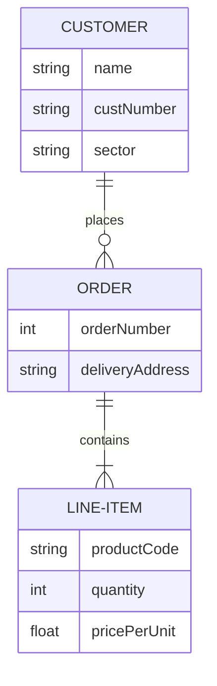
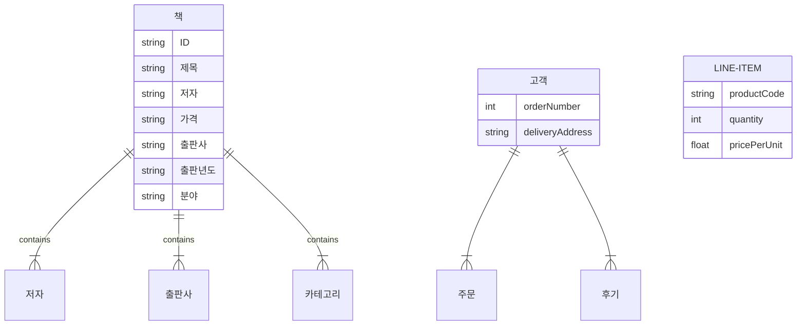
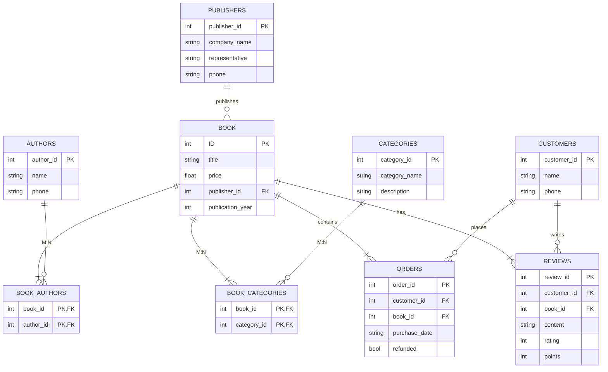
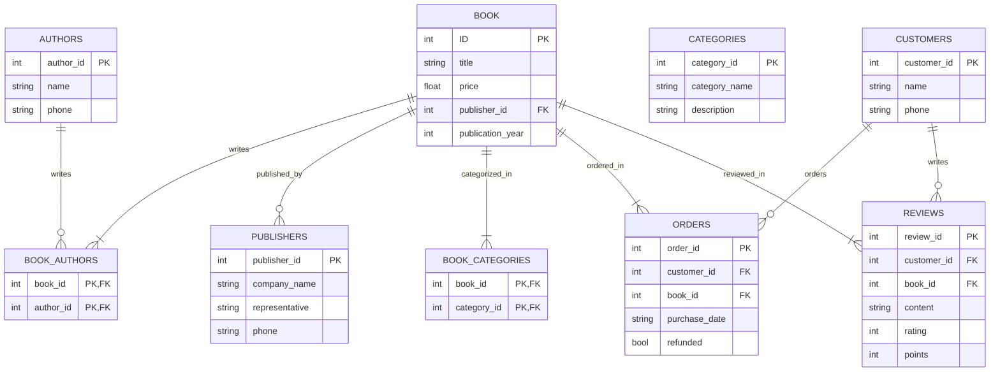

<!-- 기본 mermaid 틀 -->

```mermaid

```


```mermaid
erDiagram
    CUSTOMER ||--o{ ORDER : places
    CUSTOMER {
        string name
        string custNumber
        string sector
    }
    ORDER ||--|{ LINE-ITEM : contains
    ORDER {
        int orderNumber
        string deliveryAddress
    }
    LINE-ITEM {
        string productCode
        int quantity
        float pricePerUnit
    }

```

```mermaid
erDiagram
    책 ||--|{ 저자 : contains
    책 ||--|{ 출판사 : contains
    책 ||--|{ 카테고리 : contains
    책 {
        string ID
        string 제목
        string 저자
        string 가격
        string 출판사
        string 출판년도
        string 분야
    }
    고객 ||--|{ 주문 : ""
    고객 ||--|{ 후기 : ""
    고객 {
        int orderNumber
        string deliveryAddress
    }
    LINE-ITEM {
        string productCode
        int quantity
        float pricePerUnit
    }

```

```mermaid
erDiagram
    BOOK ||--|{ BOOK_AUTHORS : ""
    BOOK ||--|{ BOOK_CATEGORIES : "M:N"
    BOOK ||--|{ ORDERS : contains
    BOOK ||--|{ REVIEWS : has
    BOOK {
        int ID PK
        string title
        float price
        int publisher_id FK
        int publication_year
    }
    BOOK_AUTHORS {
        int book_id PK, FK
        int author_id PK, FK
    }
    AUTHORS ||--o{ BOOK_AUTHORS : "M:N"
    AUTHORS {
        int author_id PK
        string name
        string phone
    }
    PUBLISHERS ||--o{ BOOK : publishes
    PUBLISHERS {
        int publisher_id PK
        string company_name
        string representative
        string phone
    }
    BOOK_CATEGORIES {
        int book_id PK, FK
        int category_id PK, FK
    }
    CATEGORIES ||--o{ BOOK_CATEGORIES : "M:N"
    CATEGORIES {
        int category_id PK
        string category_name
        string description
    }
    CUSTOMERS ||--o{ ORDERS : places
    CUSTOMERS ||--o{ REVIEWS : writes
    CUSTOMERS {
        int customer_id PK
        string name
        string phone
    }
    ORDERS {
        int order_id PK
        int customer_id FK
        int book_id FK
        string purchase_date
        bool refunded
    }
    REVIEWS {
        int review_id PK
        int customer_id FK
        int book_id FK
        string content
        int rating
        int points
    }

```

```mermaid
erDiagram
    BOOK ||--|{ BOOK_AUTHORS : writes
    BOOK ||--o{ PUBLISHERS : published_by
    BOOK ||--|{ BOOK_CATEGORIES : categorized_in
    BOOK ||--|{ ORDERS : ordered_in
    BOOK ||--|{ REVIEWS : reviewed_in
    BOOK {
        int ID PK
        string title
        float price
        int publisher_id FK
        int publication_year
    }
    BOOK_AUTHORS {
        int book_id PK, FK
        int author_id PK, FK
    }
    AUTHORS ||--o{ BOOK_AUTHORS : writes
    AUTHORS {
        int author_id PK
        string name
        string phone
    }
    PUBLISHERS {
        int publisher_id PK
        string company_name
        string representative
        string phone
    }
    BOOK_CATEGORIES {
        int book_id PK, FK
        int category_id PK, FK
    }
    CATEGORIES {
        int category_id PK
        string category_name
        string description
    }
    CUSTOMERS ||--o{ ORDERS : orders
    CUSTOMERS ||--o{ REVIEWS : writes
    CUSTOMERS {
        int customer_id PK
        string name
        string phone
    }
    ORDERS {
        int order_id PK
        int customer_id FK
        int book_id FK
        string purchase_date
        bool refunded
    }
    REVIEWS {
        int review_id PK
        int customer_id FK
        int book_id FK
        string content
        int rating
        int points
    }

```

